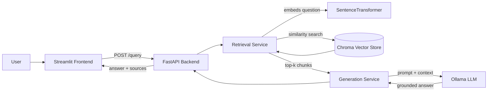

# Data Viz Course Assistant — RAG-Powered Document Assistant

A retrieval-augmented generation (RAG) app that answers questions about a Data Visualization
course's lecture notes, grounded in the actual lecture content, with sources cited. # Data Viz Course Assistant — RAG-Powered Document Assistant

A retrieval-augmented generation (RAG) app that answers questions about a Data Visualization
course's lecture notes, grounded in the actual lecture content, with sources cited. 

## Overview

Ask a question in the chat UI → the backend retrieves the most relevant lecture chunks from a
vector database → a local LLM (via Ollama) generates an answer using only that retrieved
context → the answer is returned with the lecture(s) it came from, so it never makes things up
outside the course material.

## Architecture



The vector store is built once offline (in `notebooks/rag_pipeline.ipynb`) from the source
documents and persisted to disk; the backend loads that persisted store at startup rather than
rebuilding it on every request.

## Tech Stack

| Layer | Technology |
|---|---|
| Notebook / pipeline dev | Jupyter, pandas |
| Embeddings | `sentence-transformers` (`all-MiniLM-L6-v2`) |
| Vector store | Chroma (persistent, local) |
| LLM | Ollama (local), default model `llama3.2` |
| Backend API | FastAPI + Uvicorn |
| Frontend | Streamlit |
| Tests | pytest + FastAPI `TestClient` |

## Project Structure
- `data/raw_docs/` — 5 source documents (Data Viz lecture notes, .txt)
- `notebooks/rag_pipeline.ipynb` — load → chunk → embed → store → retrieve → generate → evaluate → export
- `backend/`
  - `app/main.py` — FastAPI app, CORS, startup loading (lifespan)
  - `app/api/routes/query.py` — GET /health, POST /query
  - `app/core/config.py` — settings from .env
  - `app/schemas/query.py` — QueryRequest / QueryResponse
  - `app/services/retrieval.py` — loads vector store, retrieves chunks
  - `app/services/generation.py` — calls Ollama, builds grounded answer
  - `data/vector_store/` — populated by the notebook's Export step (2.7)
  - `tests/test_query.py`
  - `requirements.txt`, `.env.example`, `Dockerfile`
- `frontend/`
  - `app.py` — Streamlit chat UI
  - `api_client.py` — wrapper for calling the backend
  - `.env.example`, `requirements.txt`
- `requirements.txt` — for the notebook environment
- `.gitignore`


## Domain & Data

The corpus is 5 lecture decks from a university **Data Visualization** course, extracted from
PowerPoint to plain text:

1. `lecture_1.txt` — Introduction: course goals, the 6-step visualization workflow
2. `lecture_2.txt` — Comparison charts: when and how to use bar/column charts
3. `lecture_3.txt` — Comparison charts: core concepts (chart junk, magnitude, cardinality, dataset types)
4. `lecture_4.txt` — Comparison charts: stacked vs. clustered charts
5. `lecture_5.txt` — Relationship charts: scatter, bubble, and network charts; correlation, overplotting

All 5 originated as text-based slide decks (no scanned images), so no OCR was needed.

## Setup

### 0. Prerequisites

- Python 3.11 (3.12 fails to install `chroma-hnswlib` on Windows without a C++ compiler — use 3.11)
- Git, a GitHub account
- [Ollama](https://ollama.com) installed locally, with a model pulled:

ollama pull llama3.2


### 1. Build the vector store (run once)

```bash
py -3.11 -m venv .venv
.venv\Scripts\activate        # source .venv/bin/activate on Mac/Linux
pip install -r requirements.txt
```
Open `notebooks/rag_pipeline.ipynb` (VS Code or Jupyter) and run every cell top to bottom. The
last cell (Phase 2.7, Export) copies the persisted vector store into `backend/data/vector_store/`
for the backend to load.

### 2. Backend

```bash
cd backend
py -3.11 -m venv .venv
.venv\Scripts\activate
pip install -r requirements.txt
copy .env.example .env
uvicorn app.main:app --reload
```
Open http://localhost:8000/docs to try `/query` from Swagger UI.

### 3. Frontend

```bash
cd frontend
py -3.11 -m venv .venv
.venv\Scripts\activate
pip install -r requirements.txt
copy .env.example .env
streamlit run app.py
```
Open the URL Streamlit prints (usually http://localhost:8501).

### 4. Tests

```bash
cd backend
pytest
```

## Environment Variables

**backend/.env**

| Variable | Default | Meaning |
|---|---|---|
| `VECTOR_STORE_PATH` | `./data/vector_store` | Path to the persisted Chroma store |
| `CHROMA_COLLECTION_NAME` | `lecture_notes` | Chroma collection name |
| `EMBEDDING_MODEL` | `all-MiniLM-L6-v2` | Must match the model used in the notebook |
| `OLLAMA_MODEL` | `llama3.2` | Local Ollama model to use for generation |
| `OLLAMA_HOST` | `http://localhost:11434` | Ollama server address |
| `TOP_K` | `4` | Number of chunks retrieved per question |
| `CORS_ORIGINS` | `http://localhost:8501` | Allowed frontend origin |

**frontend/.env**

| Variable | Default | Meaning |
|---|---|---|
| `API_BASE_URL` | `http://localhost:8000` | Backend base URL |

## API Reference

### `GET /health`
Returns whether the vector store loaded successfully.
```bash
curl http://localhost:8000/health
```

### `POST /query`
```bash
curl -X POST http://localhost:8000/query \
  -H "Content-Type: application/json" \
  -d '{"question": "When should I use a bar chart?"}'
```
Response:
```json
{
  "answer": "Use a bar chart when you have long category names or a large number of items to rank (see [1]).",
  "sources": ["lecture_2.txt"]
}
```

## Evaluation Results

Evaluated on 12 test questions covering all 5 lectures (full transcript in
`notebooks/evaluation_results.csv`). **10/12 correct (≈83%)**.

| # | Question | Sources Retrieved | Correct |
|---|---|---|---|
| 0 | What is the goal of this course, in terms of datasets, questions, and answers? | lecture_1.txt | ✅ |
| 1 | What are the 6 steps we should follow to go from a dataset to an answer? | lecture_1.txt, lecture_3.txt | ❌ |
| 2 | What is the difference between a drag/drop-driven and a code-driven approach? | lecture_1.txt | ✅ |
| 3 | When should I use a bar chart instead of a column chart? | lecture_2.txt, lecture_3.txt | ✅ |
| 4 | What are the guidelines for drawing a good bar chart? | lecture_2.txt, lecture_3.txt | ✅ |
| 5 | What is 'chart junk' and why does it matter? | lecture_1.txt, lecture_3.txt, lecture_5.txt | ✅ |
| 6 | What is the difference between magnitude and cardinality? | lecture_3.txt, lecture_5.txt | ✅ |
| 7 | When should I use a stacked chart versus a clustered chart? | lecture_4.txt | ✅ |
| 8 | What color strategy should I use for a stacked chart? | lecture_4.txt | ✅ |
| 9 | When is a scatter plot the right choice for a dataset? | lecture_5.txt | ✅ |
| 10 | What is the difference between correlation and cardinality? | lecture_5.txt | ✅ |
| 11 | What is overplotting, and how can jittering or binning help with it? | lecture_5.txt | ❌ |

**Failure analysis:** Two questions were marked incorrect. Question 1 (the 6 steps) retrieved
chunks from both `lecture_1.txt` and `lecture_3.txt` even though the actual step list lives
entirely in `lecture_1.txt` — a retrieval precision issue, where the embedding model pulled in
an extra, unnecessary chunk from a different lecture that discusses a related but distinct
workflow concept. Question 11 (overplotting) is more of a generation issue: the model's answer
included specific causal framing that wasn't clearly grounded in the retrieved chunk, suggesting
it filled a gap with a plausible-sounding but unsupported detail rather than sticking strictly
to what was retrieved. In both cases the retrieved lecture(s) were topically relevant, so the
errors sit closer to over-retrieval and mild over-generation than to a completely wrong document
being pulled. A stricter system prompt (explicitly instructing the model to flag when the
context doesn't fully answer the question) and a slightly lower `TOP_K` would likely reduce both
kinds of error.

Separately, running Ollama locally on this machine surfaced an intermittent CUDA driver crash
(`llama-server process has terminated ... CUDA error`) on some questions; forcing Ollama into
CPU-only mode (`CUDA_VISIBLE_DEVICES=""`) resolved it at the cost of slower responses.

## Screenshots


_(Add your own screenshots to a `screenshots/` folder and update the paths above — capture the
chat UI with a real question and its grounded, cited answer visible.)_

## Notes

- The raw document corpus (`data/raw_docs/`) is small and included in the repo. The
  `backend/data/vector_store/` produced by the notebook is also small enough (well under 50MB)
  to commit directly, so no external download step is needed.
- `.env` files are gitignored — always copy from `.env.example` locally.
## Overview

Ask a question in the chat UI → the backend retrieves the most relevant lecture chunks from a
vector database → a local LLM (via Ollama) generates an answer using only that retrieved
context → the answer is returned with the lecture(s) it came from, so it never makes things up
outside the course material.

## Architecture


The vector store is built once offline (in `notebooks/rag_pipeline.ipynb`) from the source
documents and persisted to disk; the backend loads that persisted store at startup rather than
rebuilding it on every request.

## Tech Stack

| Layer | Technology |
|---|---|
| Notebook / pipeline dev | Jupyter, pandas |
| Embeddings | `sentence-transformers` (`all-MiniLM-L6-v2`) |
| Vector store | Chroma (persistent, local) |
| LLM | Ollama (local), default model `llama3.2` |
| Backend API | FastAPI + Uvicorn |
| Frontend | Streamlit |
| Tests | pytest + FastAPI `TestClient` |

## Project Structure

```
- `data/raw_docs/` — 5 source documents (Data Viz lecture notes, .txt)
- `notebooks/rag_pipeline.ipynb` — load → chunk → embed → store → retrieve → generate → evaluate → export
- `backend/`
  - `app/main.py` — FastAPI app, CORS, startup loading (lifespan)
  - `app/api/routes/query.py` — GET /health, POST /query
  - `app/core/config.py` — settings from .env
  - `app/schemas/query.py` — QueryRequest / QueryResponse
  - `app/services/retrieval.py` — loads vector store, retrieves chunks
  - `app/services/generation.py` — calls Ollama, builds grounded answer
  - `data/vector_store/` — populated by the notebook's Export step (2.7)
  - `tests/test_query.py`
  - `requirements.txt`, `.env.example`, `Dockerfile`
- `frontend/`
  - `app.py` — Streamlit chat UI
  - `api_client.py` — wrapper for calling the backend
  - `.env.example`, `requirements.txt`
- `requirements.txt` — for the notebook environment
- `.gitignore`
```

## Domain & Data

The corpus is 5 lecture decks from a university **Data Visualization** course, extracted from
PowerPoint to plain text:

1. `lecture_1.txt` — Introduction: course goals, the 6-step visualization workflow
2. `lecture_2.txt` — Comparison charts: when and how to use bar/column charts
3. `lecture_3.txt` — Comparison charts: core concepts (chart junk, magnitude, cardinality, dataset types)
4. `lecture_4.txt` — Comparison charts: stacked vs. clustered charts
5. `lecture_5.txt` — Relationship charts: scatter, bubble, and network charts; correlation, overplotting

All 5 originated as text-based slide decks (no scanned images), so no OCR was needed.

## Setup

### 0. Prerequisites

- Python 3.11 (3.12 fails to install `chroma-hnswlib` on Windows without a C++ compiler — use 3.11)
- Git, a GitHub account
- [Ollama](https://ollama.com) installed locally, with a model pulled:
  ```
  ollama pull llama3.2
  ```

### 1. Build the vector store (run once)

```bash
py -3.11 -m venv .venv
.venv\Scripts\activate        # source .venv/bin/activate on Mac/Linux
pip install -r requirements.txt
```
Open `notebooks/rag_pipeline.ipynb` (VS Code or Jupyter) and run every cell top to bottom. The
last cell (Phase 2.7, Export) copies the persisted vector store into `backend/data/vector_store/`
for the backend to load.

### 2. Backend

```bash
cd backend
py -3.11 -m venv .venv
.venv\Scripts\activate
pip install -r requirements.txt
copy .env.example .env
uvicorn app.main:app --reload
```
Open http://localhost:8000/docs to try `/query` from Swagger UI.

### 3. Frontend

```bash
cd frontend
py -3.11 -m venv .venv
.venv\Scripts\activate
pip install -r requirements.txt
copy .env.example .env
streamlit run app.py
```
Open the URL Streamlit prints (usually http://localhost:8501).

### 4. Tests

```bash
cd backend
pytest
```

## Environment Variables

**backend/.env**

| Variable | Default | Meaning |
|---|---|---|
| `VECTOR_STORE_PATH` | `./data/vector_store` | Path to the persisted Chroma store |
| `CHROMA_COLLECTION_NAME` | `lecture_notes` | Chroma collection name |
| `EMBEDDING_MODEL` | `all-MiniLM-L6-v2` | Must match the model used in the notebook |
| `OLLAMA_MODEL` | `llama3.2` | Local Ollama model to use for generation |
| `OLLAMA_HOST` | `http://localhost:11434` | Ollama server address |
| `TOP_K` | `4` | Number of chunks retrieved per question |
| `CORS_ORIGINS` | `http://localhost:8501` | Allowed frontend origin |

**frontend/.env**

| Variable | Default | Meaning |
|---|---|---|
| `API_BASE_URL` | `http://localhost:8000` | Backend base URL |

## API Reference

### `GET /health`
Returns whether the vector store loaded successfully.
```bash
curl http://localhost:8000/health
```

### `POST /query`
```bash
curl -X POST http://localhost:8000/query \
  -H "Content-Type: application/json" \
  -d '{"question": "When should I use a bar chart?"}'
```
Response:
```json
{
  "answer": "Use a bar chart when you have long category names or a large number of items to rank (see [1]).",
  "sources": ["lecture_2.txt"]
}
```

## Evaluation Results

Evaluated on 12 test questions covering all 5 lectures (full transcript in
`notebooks/evaluation_results.csv`). **10/12 correct (≈83%)**.

| # | Question | Sources Retrieved | Correct |
|---|---|---|---|
| 0 | What is the goal of this course, in terms of datasets, questions, and answers? | lecture_1.txt | Yes |
| 1 | What are the 6 steps we should follow to go from a dataset to an answer? | lecture_1.txt, lecture_3.txt | No |
| 2 | What is the difference between a drag/drop-driven and a code-driven approach? | lecture_1.txt | Yes |
| 3 | When should I use a bar chart instead of a column chart? | lecture_2.txt, lecture_3.txt | Yes |
| 4 | What are the guidelines for drawing a good bar chart? | lecture_2.txt, lecture_3.txt | Yes |
| 5 | What is 'chart junk' and why does it matter? | lecture_1.txt, lecture_3.txt, lecture_5.txt | Yes |
| 6 | What is the difference between magnitude and cardinality? | lecture_3.txt, lecture_5.txt | Yes |
| 7 | When should I use a stacked chart versus a clustered chart? | lecture_4.txt | Yes |
| 8 | What color strategy should I use for a stacked chart? | lecture_4.txt | Yes |
| 9 | When is a scatter plot the right choice for a dataset? | lecture_5.txt | Yes |
| 10 | What is the difference between correlation and cardinality? | lecture_5.txt | Yes |
| 11 | What is overplotting, and how can jittering or binning help with it? | lecture_5.txt | No |

**Failure analysis:** Two questions were marked incorrect. Question 1 (the 6 steps) retrieved
chunks from both `lecture_1.txt` and `lecture_3.txt` even though the actual step list lives
entirely in `lecture_1.txt` — a retrieval precision issue, where the embedding model pulled in
an extra, unnecessary chunk from a different lecture that discusses a related but distinct
workflow concept. 

Question 11 (overplotting) is more of a generation issue: the model's answer
included specific causal framing that wasn't clearly grounded in the retrieved chunk, suggesting
it filled a gap with a plausible-sounding but unsupported detail rather than sticking strictly
to what was retrieved. In both cases the retrieved lecture(s) were topically relevant, so the
errors sit closer to over-retrieval and mild over-generation than to a completely wrong document
being pulled. A stricter system prompt (explicitly instructing the model to flag when the
context doesn't fully answer the question) and a slightly lower `TOP_K` would likely reduce both
kinds of error.

Separately, running Ollama locally on this machine surfaced an intermittent CUDA driver crash
(`llama-server process has terminated ... CUDA error`) on some questions; forcing Ollama into
CPU-only mode (`CUDA_VISIBLE_DEVICES=""`) resolved it at the cost of slower responses.


